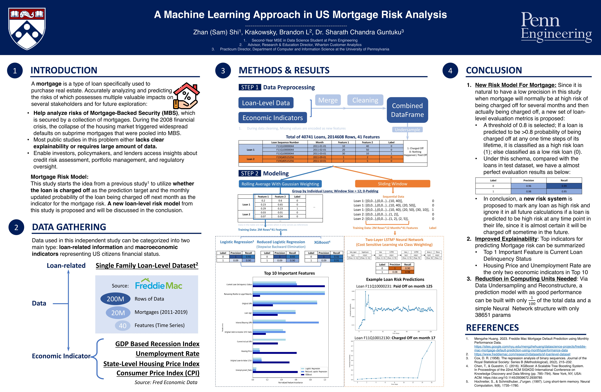

# A-Machine-Learning-Approach-for-US-Mortgage-Risk-Analysis 🏠
The code base for the independent study of "A Machine Learning Approach for US Mortgage Risk Analysis" by Sam Shi finished as a practicum at University of Pennsylvania.

## Overview
This repository contains the source code and datasets for a independent study focused on enhancing mortgage risk analysis. Our study is motivated by the significant impact that MBS can have on the broader economy, as was evident during the 2008 financial crisis. We address the challenges in current public studies which often lack explainability or rely on extensive data for accurate predictions.

## Objectives
Our independent study introduces a innovative machine learning methodology to improve mortgage default risk analysis through three key approaches:
1. **Interpretable Models**: We focus on developing models that are not only accurate but also interpretable, highlighting the top 10 risk-augmenting features that influence mortgage defaults.
2. **LSTM-based Predictions**: We demonstrate the efficacy of a Long Short-Term Memory (LSTM)-based model in generating reliable predictions from limited data sets.
3. **Loan-Level Framework**: A new framework at the loan level is proposed for a more nuanced assessment of mortgage risks.

## Insights and Impact
The insights gained from our study are intended to assist various stakeholders including investors, policymakers, and lenders. Our approach aims to contribute to:
- **Better Understanding of Mortgage Risk**: Providing deeper insights into the factors that contribute to mortgage Charge-off.
- **Optimized Portfolio Management**: Assisting in the management of MBS portfolios by identifying key risk factors.
- **Refined Regulatory Practices**: Offering data-driven insights for policymakers to refine regulatory practices related to mortgage lending and risk management.

## Repository Structure
- `Economic Datasets/`: Directory containing datasets used in the analysis.
- `Modeling/`: Implementation of the LSTM model and other machine learning models.
- `Pre-Modeling/`: Jupyter notebooks demonstrating the EDA and Data Preprocessing.

## How to Use
Detailed instructions on how to set up the environment, run the models, and replicate the study are provided in the respective Jupyter Notebooks.

## License
This project is licensed under the terms of the [MIT License](LICENSE).

## Contact
For any inquiries or collaboration proposals, please feel free to contact the repository maintainers.

## Poster

---

*Note: This study is for academic and research purposes and should be interpreted with caution in practical applications.*
